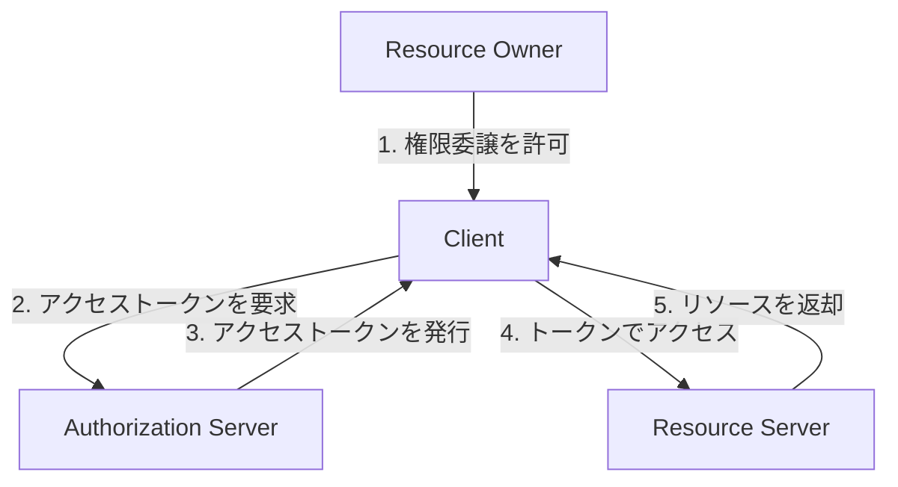
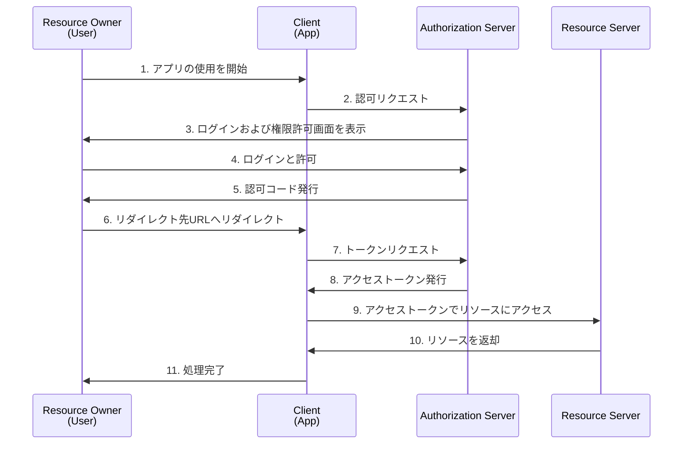
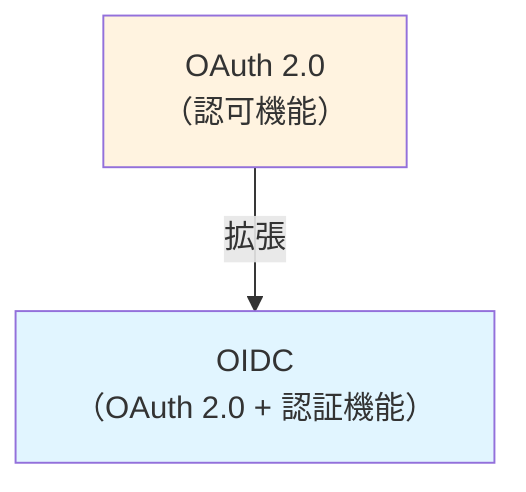
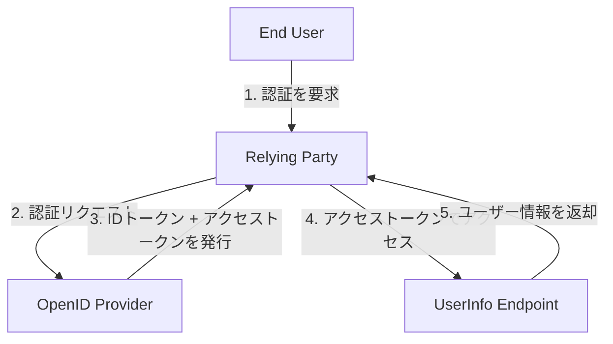
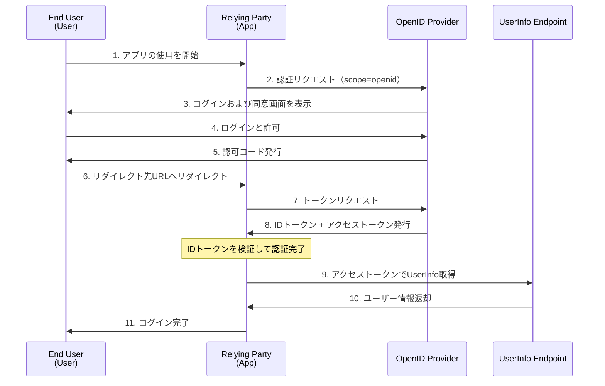

## OAuthとは

一言で言うと、**ユーザーが持っているリソースに安全にアクセスするための仕組み**です。

例えば、あるアプリが特定のユーザーのGoogle Driveのリソースにアクセスしたいとします。

この場合、そのままではアプリはリソースにはアクセスできません。アプリはユーザーの認証情報を知らないため、Google Driveにログインできないからです。

そこで利用するのがOAuthです。OAuthを使うことで、ユーザーの許可を得た上で、アプリからユーザーのリソース（e.g. Google Driveなど）にアクセスできるようになります。（これを**権限委譲**と呼びます）

### OAuthの構成要素

OAuthの主な構成要素は、以下の4つです。

- **Resource Owner（リソースオーナー）**: リソースの所有者（ユーザー自身）
- **Client（クライアント）**: ユーザーのリソースにアクセスしたいサードパーティアプリ
- **Authorization Server（認可サーバー）**: アクセストークンを発行するサーバー
- **Resource Server（リソースサーバー）**: 保護されたリソース（e.g. Google Drive）を提供するサーバー

### OAuth 2.0のグラントタイプ（Authorization Code Grant）

**グラントタイプ**とは、OAuth 2.0において**クライアントがアクセストークンを取得するための手法**を指します。

OAuth 2.0には4つのグラントタイプが存在しますが、中でも代表的な**Authorization Code Grant**は以下の流れになります。

## OIDCとは

OIDC（OpenID Connect）とは、OAuth 2.0を拡張した**認証のためのプロトコル**です。

### OIDCでできること

OAuthは「認可」の役割に特化しており、ユーザーのリソース（e.g. Google Drive）へのアクセス権限を付与することに焦点を当てていました。

一方、OIDCを利用することで、認可に加えて「認証」も可能になります。例えば、IDプロバイダ（GoogleやGitHubなど）が提供するアカウントを使用して、サードパーティアプリにログインできるようになります。（e.g. GitHubアカウントでVercelにログイン）

### OIDCの位置付け

OAuth 2.0が「認可」のためのアクセストークン発行フローを定めているのに対し、OIDCはそれを拡張して「認証」のための**IDトークン**も発行できるようにしたものです。

### OIDCの構成要素

**OIDC = OAuth 2.0 + IDトークン + UserInfoエンドポイント**

| 要素 | 説明 |
|------|------|
| **IDトークン** | ユーザーの認証情報を含むJWT（JSON Web Token）形式のトークン |
| **UserInfoエンドポイント** | ユーザーの属性情報（クレーム）を取得するAPI |

- **End User（エンドユーザー）**: 認証されるユーザー自身
- **Relying Party（リライング・パーティ）**: OIDCを利用してユーザー認証を行うサードパーティアプリ
- **OpenID Provider（Identity Provider/IdP）**: IDトークンとアクセストークンを発行するサーバー（e.g. Google、GitHubなどのIdP）
- **UserInfo Endpoint（UserInfoエンドポイント）**: ユーザーの属性情報（クレーム）を提供するエンドポイント

### OIDCの認証フロー（Authorization Code Flow）

アクセストークンを取得する方法について、OAuthではグラントタイプと呼んでいましたが、OIDCでは**フロー**と呼びます。

OIDCには3つのフローが存在しますが、中でも代表的な**Authorization Code Flow**は以下のようになります。

OAuth 2.0との主な違いは以下の2点です。

1. **scopeにopenidを含める**: これによりOIDCの認証フローとして動作します。これが指定されない場合、IDトークンが発行されず、UserInfoエンドポイントへのアクセス権も得られません
2. **IDトークンが発行される**: ユーザーの認証情報を含む、JWT形式のトークンです

## まとめ

本記事では、OAuthとOIDCについて図を交えながら解説しました。この記事が、OAuthとOIDCを理解する助けになれば幸いです。

### 重要ポイントの振り返り

| 項目 | OAuth 2.0 | OIDC |
|------|-----------|------|
| **目的** | 認可（Authorization） | 認可 + 認証（Authentication） |
| **主な用途** | リソースへのアクセス許可 | ログイン・シングルサインオン（SSO） |
| **発行されるトークン** | アクセストークン | アクセストークン + IDトークン |
| **例** | サードパーティアプリからGoogle Driveへのアクセス権限を取得 | サードパーティアプリにGoogleアカウントでログイン |

## 参考資料

- [RFC 6749 - OAuth 2.0](https://datatracker.ietf.org/doc/html/rfc6749)
- [OpenID Connect Core 1.0](https://openid.net/specs/openid-connect-core-1_0.html)
- [OAuth、OAuth認証、OpenID Connectの違いを整理して理解できる本](https://booth.pm/ja/items/1550861)
- [一番分かりやすい OAuth の説明](https://qiita.com/TakahikoKawasaki/items/e37caf50776e00e733be)
- [OAuth 2.0 全フローの図解と動画](https://qiita.com/TakahikoKawasaki/items/200951e5b5929f840a1f)
- [一番分かりやすい OpenID Connect の説明](https://qiita.com/TakahikoKawasaki/items/498ca08bbfcc341691fe)
- [IDトークンが分かれば OpenID Connect が分かる](https://qiita.com/TakahikoKawasaki/items/8f0e422c7edd2d220e06)
- [OpenID Connect 全フロー解説](https://qiita.com/TakahikoKawasaki/items/4ee9b55db9f7ef352b47)
