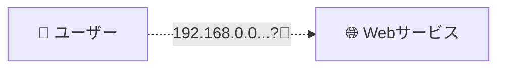
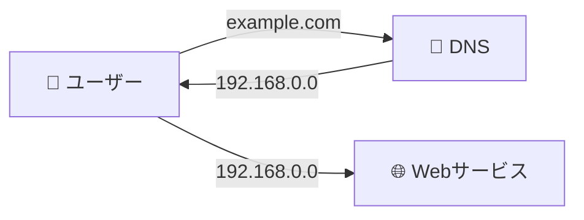
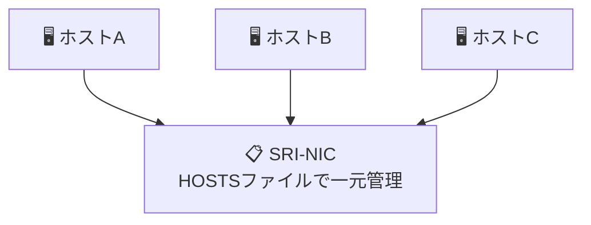
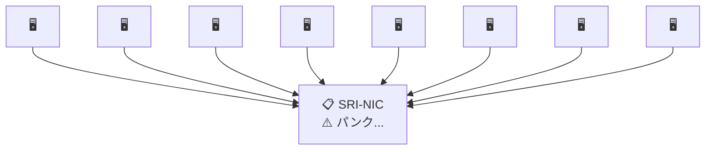
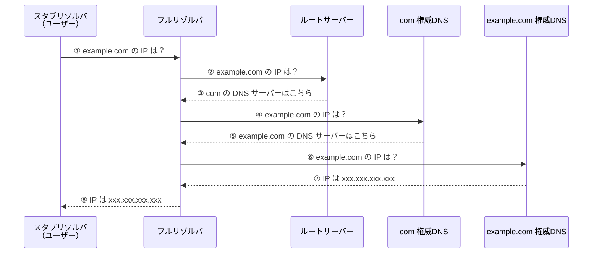

- DNSの基礎を学びたい
- 実際に手を動かしながらDNSのイメージを掴みたい

この記事はこういった方向け。

DNSが登場した背景や仕組みを解説しつつ、実際に手を動かしながらDNSの理解を深めていきます。

少しでもDNSを理解したいと思っている方の参考になれば幸いです。

## DNSが生まれた背景

WebサービスはIPアドレス（e.g. 192.168.0.0）によって識別されます。

これはWebサービスを一意に管理する上で、とても便利な仕組みです。

しかし、IPアドレスには欠点があります。

それは、数字の羅列であるため**人間が覚えにくい**点です。



そこで誕生したのが、DNS（Domain Name System）という、人間が覚えやすい名前（ドメイン）をIPアドレスに変換する仕組みです。



人間は、ドメイン名さえ覚えておけばWebサービスにアクセスできるようになりました。

## DNSの仕組み

当初、ドメインとIPアドレスの対応関係は、**SRI-NIC**という組織によって、HOSTSファイルで**一元管理**されていました。



しかし、インターネットの成長とユーザー数の増加に伴い、一元管理には限界が来てしまいました。



そこで誕生したのが、**階層化**と**委任**の概念を採用した、今のDNSの**分散管理**の形です。

DNSでは、ドメイン名に対応する形で管理範囲（**ゾーン**）を階層化し、委任することで管理を分散します。

それぞれのゾーンの管理者は**ネームサーバー**というサーバーで、以下のいずれかの情報を管理します。

- **そのゾーンに存在するホストのドメイン名とIPアドレス**
- **委任先（子）のネームサーバーの情報**

例えば、example.comというドメインの場合、以下の流れで名前解決（ドメイン名からIPアドレスのへの変換）が行われます。



1. **フルリゾルバ**（スタブリゾルバの代わりに名前解決を行うコンピュータ）を用意する。フルリゾルバには、ルートサーバーのIPアドレスが書かれた表（**ルートヒント**）を持たせる
2. **スタブリゾルバ**（ユーザー）はフルリゾルバに名前解決を依頼する
3. フルリゾルバは、ルートサーバー（ルートにいる権威DNSサーバー）にexample.comのIPアドレスを問い合わせる
4. ルートサーバーはこのアドレスに対するIPアドレスの情報は管理していない。しかし、comを管理している権威DNSサーバーの情報（委任情報）は知っているので、問い合わせ元にcomの権威DNSサーバーの情報を返す
5. 応答を受け取ったフルリゾルバは、その情報を元にcomの権威DNSサーバーに対し、③と同様の形でexample.comのIPアドレスを問い合わせる
6. comのDNSサーバーも、ルートサーバーと同様自分が知っているexample.jpのDNSサーバーの情報（委任情報）を問い合わせ元に返す
7. 応答を受け取ったフルリゾルバはその情報を元にexample.jpの権威DNSサーバーに対し、③と同様の形でexample.comのIPアドレスを問い合わせる
8. example.comの権威DNSサーバーは、自分が管理している対応表からexample.jpのIPアドレス情報を問い合わせ元に返す
9. フルリゾルバは、入手したIPアドレスの情報をスタブリゾルバ（ユーザー）に返す

このようにDNSでは、フルリゾルバがそれぞれのネームサーバに対し、ルートサーバから順に**繰り返しによる解決**（**iterative resolution**）を行うことにより、名前解決が実施されます。

## DNSの設定方法

では、具体的にどのようにDNSの設定をすればよいのでしょうか？

基本的な流れは以下の通りです。

1. レジストラからドメイン名を購入する
2. 購入したドメイン名を管理するネームサーバーを動作させる
3. ドメイン名をネームサーバーに登録する
4. ドメインを購入したレジストラにネームサーバー情報の設定を申請する
5. レジストラは、レジストリデータベースにネームサーバー情報を設定するための申請をレジストリに提出する
6. レジストリはネームサーバー情報をレジストリデータベースに登録し、レジストリの管理するネームサーバーにその情報を設定する。これにより、親に子のネームサーバー情報が設定され、レジストリと登録者の関係が親子関係となる
7. ドメイン名にアクセスしてレスポンスが返ってくるかを確認する

※レジストラ=ドメイン名登録者からの申請を取り次ぐ（e.g. お名前.com）
※レジストリ=TLD（Top Level Domain）ごとにドメイン名の一元管理を行う（e.g. JPRS）

これだけだとイメージが掴みづらいと思うので、次に実際にDNSを触りながら理解を深めていきます。

## DNSチュートリアル

今回は、**お名前.comで取得したドメインをCloud DNSでWebサービスのIPと紐付けます。**

チュートリアル全体の流れは以下の通りです。

1. 表示する簡易アプリケーションの構築
    - Compute Engine 仮想マシン（VM）インスタンスを作成
    - 基本的な Apache ウェブサーバーを実行
2. お名前.comでドメインを購入（取得）
3. Cloud DNSにドメインとVMのIPを設定
4. お名前.comでネームサーバー（Cloud DNS）の設定を追加
5. ドメイン名でアクセスできるか確認

### 1. 表示する簡易アプリケーションの構築

まずは、ドメインを設定する簡易的なアプリケーションを作成します。

Compute Engine 仮想マシン（VM）のインスタンスを作成しましょう。

設定内容は、以下の項目以外は任意の値で問題ないです。

- イメージに`Debian GNU/Linux`を選択
  - Apacheインストール時に`apt-get`コマンドを実行するため
- マシンタイプは`e2-micro`
  - なるべく料金をかけないため
- ファイアウォールで、`HTTP トラフィックを許可する`を選択
  - 外部からHTTPでアクセスできるようにするため

次に、VM上で Apache ウェブサーバーを実行します。

SSHでVMに入った上で、以下のコマンドを実行しましょう。

```shell
sudo apt-get update && sudo apt-get install apache2 -y
```

さらに、以下のコマンドを実行して、デフォルトページを任意のものに変更します。

```shell
echo '<!doctype html><html><body><h1>DNS Tutorial</h1></body></html>' | sudo tee /var/www/html/index.html
```

VMの外部IPにアクセスして、以下のように表示されたら簡易アプリの作成は完了です。

```text
+------------------------------------------+
|                                          |
|          DNS Tutorial                    |
|                                          |
+------------------------------------------+
```

参考: [チュートリアル: Cloud DNS を使用してドメインを設定する](https://cloud.google.com/dns/docs/tutorials/create-domain-tutorial?hl=ja)

### 2. お名前.comでドメインを購入（取得）

次に、[お名前.com](https://www.onamae.com/)でドメインを購入(取得)します。

特にこだわりが無ければ、0円のドメインを取得するのがおすすめです。

今回は`dns-tutorial.com`を取得しました。

### 3. Cloud DNSにドメインとVMのIPを設定

Cloud DNSで取得したドメイン（dns-tutorial.com）と VM のIPを紐付けます。

基本的には[こちら](https://cloud.google.com/dns/docs/tutorials/create-domain-tutorial?hl=ja#set-up-domain)と同じように以下の設定をします。

1. ゾーンを作成
2. ゾーンのタイプは「一般公開」
3. ゾーン名に任意の値を設定
4. DNS名は`dns-tutorial.com`（取得したドメイン）を設定
4. DNSSECはオフ
5. 作成をクリック

| 設定項目 | 設定値 |
| --- | --- |
| ゾーンのタイプ | 一般公開 |
| ゾーン名 | 任意の値 |
| DNS名 | `dns-tutorial.com` |
| DNSSEC | オフ |

次に、レコードにドメイン名と（dns-tutorial.com）とVMのIPの対応関係を設定します。

ゾーンの詳細画面にある`標準を追加`をクリックします。

作成するのは`Aレコード`で、IPv4アドレスに、VMの外部IPアドレスを入力します。

| 設定項目 | 設定値 |
| --- | --- |
| リソースレコードのタイプ | A |
| IPv4 アドレス | VMの外部IPアドレス |

作成をクリックするとレコードが作成されます。

これでレコードの設定は完了です。

#### リソースレコードのタイプについて

今回はAレコードのみ設定しましたが、DNSのレコード（設定項目）にはいくつか種類があります。
それぞれ意味を理解しておくようにしましょう。

- A
  - ドメイン名のIPv4アドレスを指定
- AAAA（クワッドエー）
  - ドメイン名のIpv6アドレスを指定
- NS
  - ゾーンの権威サーバーのホスト名を指定
  - 委任元と委任先のどちらにも同じ値を設定することにより、親子関係が成立する
- CNAME（Canonical Name）
  - ドメイン名に別名を付ける

### 4. お名前.comでネームサーバー（Cloud DNS）の設定を追加

次に、お名前.comでネームサーバー（Cloud DNS）の設定を追加します。

これにより、委任情報が紐付けられ、ドメイン間の親子関係が成立する（com -> dns-tutorial.com -> IP と`iterative resolution`が実行できるようになる）ので、ドメイン名でアプリにアクセスできるようになります。

[お名前.com](https://www.onamae.com/)の管理画面から「ネームサーバーの設定」>「ネームサーバーの変更」を選択します。

対象のドメインを選択し、ネームサーバーにCloud DNSの`NSレコード`の情報（ゾーンを作成したときに自動的に作成されるレコード）を設定します。

```text
ネームサーバー設定例:
  ネームサーバー1: ns-cloud-x1.googledomains.com
  ネームサーバー2: ns-cloud-x2.googledomains.com
  ネームサーバー3: ns-cloud-x3.googledomains.com
  ネームサーバー4: ns-cloud-x4.googledomains.com
```

※ 実際の値は Cloud DNS のゾーン作成時に自動生成される NS レコードを確認してください。

画面下にある「確認」ボタンをクリックして、設定内容に問題がなければ「OK」をクリックします。

以上で全ての設定が完了です。

### 5. ドメイン名でアクセスできるか確認

最後に、ドメイン名を指定してアプリにアクセスできるかを確認しましょう。

```text
🌐 http://dns-tutorial.com
+------------------------------------------+
|                                          |
|          DNS Tutorial                    |
|                                          |
+------------------------------------------+
```

アクセスできました！🎉

※表示できない場合は、まだ設定が反映されていない可能性があるので、少し時間をあけて再度アクセスしてみましょう
※クラウドリソースには料金がかかるので、動作確認が終わったらVMとCloud DNSの設定は削除しましょう

## おわりに

今回は以上です。

この記事が、DNSの理解を深める上で少しでも参考になっていれば幸いです。

最後まで読んでいただきありがとうございました。

## 参考資料

以下の[JPRS](https://jprs.co.jp/)が提供している資料はいずれも分かりやすいのでおすすめです。

- [DNSがよくわかる教科書](https://amzn.asia/d/cQrCnBD)
- [ポン太のネットの大冒険](https://jprs.jp/related-info/study/ponta.pdf)
- [ポン太のインターネット教室](https://withponta.jp/)
- [DNSのしくみと動作原理～インターネットを支え続けるDNS～](https://jprs.jp/related-info/guide/topics-column/no10.html)
